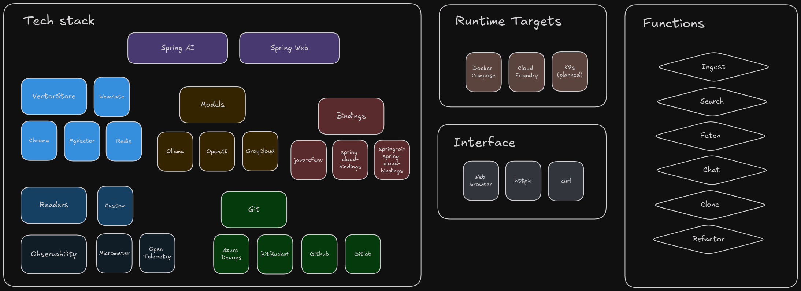

# R*bert

     

Perhaps you've heard about OSS tools like [Dependabot](https://docs.github.com/en/code-security/getting-started/dependabot-quickstart-guide#about-dependabot), [Snyk](https://snyk.io/product/), [OpenRewrite](https://docs.openrewrite.org/).  Maybe you've even researched and experimented with commercial editions like [Moderne](https://www.moderne.ai/) or [Spring Application Advisor](https://docs.vmware.com/en/Tanzu-Spring-Runtime/Commercial/Tanzu-Spring-Runtime/app-advisor-what-is-app-advisor.html).

These tools are great for upgrading the dependencies your applications rely on.  And the commercial editions mentioned will even help resolve breaking API changes sometimes introduced by version upgrades.

Subscription offerings like: [Github Copilot](https://docs.github.com/en/copilot/quickstart), [Codeium](https://codeium.com/), [Tabnine](https://docs.tabnine.com/main), [Amazon Q Developer](https://aws.amazon.com/q/developer/), [Gemini CodeAssist (Google Cloud)](https://cloud.google.com/gemini/docs/codeassist/overview) are also worth considering.

R*bert is an alternative that taps into the corpus of knowledge continuing to evolve in LLMs and employs carefully constructed prompts to refactor slices of source code.

* [Background](docs/BACKGROUND.md)
* [Prerequisites](docs/PREREQUISITES.md)
* [Tools](docs/TOOLS.md)
* How to
  * [Clone](docs/CLONING.md)
  * [Build](docs/BUILD.md)
  * [Run](docs/RUN.md)
  * [Consume endpoints](docs/ENDPOINTS.md)
* [Credits](docs/CREDITS.md)

